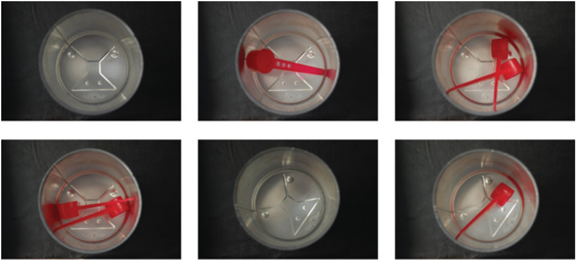

The Problems are Part of the [Book](https://www.amazon.in/Practical-Introduction-Computer-Imaging-Technology/dp/1118848454) by Kenneth Dawson-Howe;  assets for this can be found [here](https://publications.scss.tcd.ie/book-supplements/A-Practical-Introduction-to-Computer-Vision-with-OpenCV/Problems/) (provided by the author).

## 1. Baby Food

On a production line cans of baby food are made by:
1.  Fabricating the sides and lid of the can together but omitting the base of the can.
2.  Dropping a spoon into the empty upside-down can.
3.  Pouring the baby food (powder) into upside-down the can.
4.  Sealing the base onto the can.

You are asked to develop an inspection system looking at the can between steps 2 and 3 in order to check that a single spoon has been placed into it.

